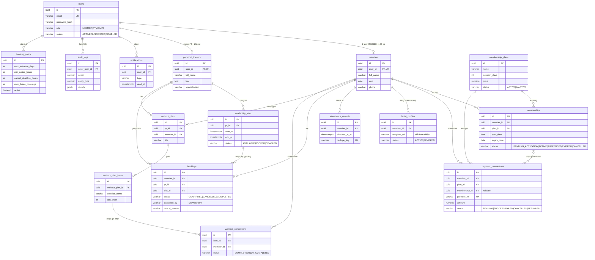

# ERD — FitCenter Core Database

Sơ đồ dưới dùng Mermaid, GitHub tự hiển thị khi mở file này trên web.
Chỉ liệt kê cột chính; xem chi tiết kiểu dữ liệu và constraint trong `migrations/`.

```mermaid
erDiagram
    users ||--o| members : "1 user MEMBER - 1 hồ sơ"
    users ||--o| personal_trainers : "1 user PT - 1 hồ sơ"
    users ||--o{ notifications : "nhận"
    users ||--o{ audit_logs : "thực hiện"
    users ||--o{ booking_policy : "cập nhật"

    members ||--o{ memberships : "sở hữu"
    membership_plans ||--o{ memberships : "áp dụng"
    members ||--o{ payment_transactions : "thanh toán"
    membership_plans ||--o{ payment_transactions : "mua gói"
    memberships |o--o{ payment_transactions : "được gia hạn bởi"

    members ||--o{ facial_profiles : "đăng ký khuôn mặt"
    members ||--o{ attendance_records : "check in"

    personal_trainers ||--o{ availability_slots : "công bố"
    availability_slots ||--o{ bookings : "được đặt (lịch sử)"
    members ||--o{ bookings : "đặt"
    personal_trainers ||--o{ bookings : "phụ trách"

    personal_trainers ||--o{ workout_plans : "tạo"
    members ||--o{ workout_plans : "được giao"
    workout_plans ||--o{ workout_plan_items : "gồm"
    workout_plan_items ||--o{ workout_completions : "được ghi nhận"
    members ||--o{ workout_completions : "hoàn thành"

    users {
        uuid id PK
        varchar email UK
        varchar password_hash
        varchar role "MEMBER|PT|ADMIN"
        varchar status "ACTIVE|SUSPENDED|DISABLED"
    }
    members {
        uuid id PK
        uuid user_id FK,UK
        varchar full_name
        date dob
        varchar phone
    }
    personal_trainers {
        uuid id PK
        uuid user_id FK,UK
        varchar full_name
        text bio
        varchar specialization
    }
    membership_plans {
        uuid id PK
        varchar name
        int duration_days
        numeric price
        varchar status "ACTIVE|INACTIVE"
    }
    memberships {
        uuid id PK
        uuid member_id FK
        uuid plan_id FK
        date start_date
        date expiry_date
        varchar status "PENDING_ACTIVATION|ACTIVE|SUSPENDED|EXPIRED|CANCELLED"
    }
    payment_transactions {
        uuid id PK
        uuid member_id FK
        uuid plan_id FK
        uuid membership_id FK "nullable"
        varchar provider_ref UK
        numeric amount
        varchar status "PENDING|SUCCESS|FAILED|CANCELLED|REFUNDED"
    }
    facial_profiles {
        uuid id PK
        uuid member_id FK
        varchar template_ref "chỉ tham chiếu"
        varchar status "ACTIVE|REVOKED"
    }
    attendance_records {
        uuid id PK
        uuid member_id FK
        timestamptz checked_in_at
        varchar dedupe_key UK
    }
    availability_slots {
        uuid id PK
        uuid pt_id FK
        timestamptz start_at
        timestamptz end_at
        varchar status "AVAILABLE|BOOKED|DISABLED"
    }
    bookings {
        uuid id PK
        uuid member_id FK
        uuid pt_id FK
        uuid slot_id FK
        varchar status "CONFIRMED|CANCELLED|COMPLETED"
        varchar cancelled_by "MEMBER|PT"
        varchar cancel_reason
    }
    booking_policy {
        uuid id PK
        int max_advance_days
        int min_notice_hours
        int cancel_deadline_hours
        int max_future_bookings
        boolean active
    }
    workout_plans {
        uuid id PK
        uuid pt_id FK
        uuid member_id FK
        varchar title
    }
    workout_plan_items {
        uuid id PK
        uuid workout_plan_id FK
        varchar exercise_name
        int sort_order
    }
    workout_completions {
        uuid id PK
        uuid item_id FK
        uuid member_id FK
        varchar status "COMPLETED|NOT_COMPLETED"
    }
    notifications {
        uuid id PK
        uuid user_id FK
        varchar type
        timestamptz read_at
    }
    audit_logs {
        uuid id PK
        uuid actor_user_id FK
        varchar action
        varchar entity_type
        jsonb details
    }
```
